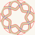

# Kalimba

A seven-sided kalimba body with a seven-fold knot rosette cut into one face, plus the
rosette on its own. Output is millimetre-true — `1 user unit = 1 mm` with a physical
`width`/`height` — so it prints and cuts at real size.

<table>
<tr>
<td align="center"></td>
</tr>
<tr>
<td align="center">KalimbaSeptaBox.svg · the whole body, 583 × 270mm sheet</td>
</tr>
<tr>
<td align="center"></td>
</tr>
<tr>
<td align="center">KalimbaSeptafoilSoundhole-r30.svg · the rosette alone, 61 × 61mm</td>
</tr>
</table>

*Click either to download it. These are display renderings — the cut files draw a hairline
on no background, which a browser shows almost invisibly.*

**[Read the writeup](https://gernreich.github.io/kalimba/)**

Built for **[LaserMadeMusic](https://www.youtube.com/@LaserMadeMusic)**, where the cutting
and assembly are shown.

**[Download everything as a ZIP](https://github.com/Gernreich/kalimba/archive/refs/heads/main.zip)** — both cut files.

## What is on the sheet

Measured out of the file, not copied from whatever drew it:

| Part | Count | Size | Stroke |
|---|---|---|---|
| Side panels, finger-jointed | 7 | 79.3 × 65.3mm each | black |
| Face, plain | 1 | 175.8 × 171.4mm | black |
| Face, with the rosette | 1 | 175.8 × 171.7mm | purple `#7c00ff` |
| Rosette cut | — | 60mm circle | red `#ff0000` |
| Rosette engrave | — | interlace hints | blue `#0000ff` |
| Reference bar | 1 | 100 × 10mm | black — **do not cut** |

Seven sides, two faces, and a rosette that is a septafoil — one ribbon crossing itself
seven times, so the hole echoes the plan of the box.

## Two things to fix before you send it

**The reference bar is not a part.** It is a 100mm scale marker the generator adds,
labelled `100.0mm, burn:0.07mm`. **Its rectangle is the same black as the seven side
panels**, so a colour-keyed job cutting black will cut it too. Delete it or move it to a
non-cutting layer.

**The blue is an engrave, not a cut.** Those lines cross the ribbon; cutting them severs
it. Give them a score or engrave operation, or delete the layer.

## The sound hole

`KalimbaSeptafoilSoundhole-r30.svg` is a 30mm radius hole, one self-crossing ribbon 4mm
wide with seven crossings, 56% of the disc removed, narrowest cut 4.30mm. Its cut path
data is byte-for-byte identical to `2-lead_7-bight_knot_radius30mm.svg` in
**[knotwork-soundholes](https://gernreich.github.io/knotwork-soundholes/)**, which
documents the family and generates any coprime leads × bights.

It is an earlier render: it still carries a `preview` group filled `#d8c9a8` that is no
longer emitted, and it predates the rim continuations the current generator adds. The cut
is unaffected either way.

## Before you cut

**The finger joints were generated for one specific thickness**, and the sheet does not
record which. Too thin and they rattle; too thick and they will not go together. Cut a
test joint before committing the full sheet.

**Nothing here has been validated against cut stock**, and no acoustic claim is made. The
tines, bridge and tuning are not in these files — this is the body only.

## Files

| | |
|---|---|
| `KalimbaSeptaBox.svg` | the whole body — seven sides, two faces, rosette, reference bar |
| `KalimbaSeptafoilSoundhole-r30.svg` | the rosette on its own |
| `previews/` | display renderings — **not** cut files |
| `index.md` · `index.html` | the published page; the markdown is the source |

Released under [CC0 1.0](LICENSE).
