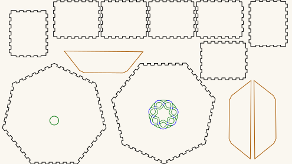

# Kalimba — a seven-sided body with a septafoil rosette

A kalimba is a lamellophone: tuned metal tines fixed over a bridge on a resonating
body, plucked with the thumbs. This repository holds the **body** — a seven-sided box
whose front carries a seven-fold knot rosette.

Seven and seven is the whole idea. The box has seven sides, and the rosette is a
septafoil: one continuous ribbon crossing itself seven times, so the sound hole echoes
the plan of the thing it is cut into.

**The tines, bridge and tuning are not here.** Nothing in this file is an instrument on
its own.

## Get the files

- **[Download the cut file](KalimbaSeptaBox.svg)** — the whole body on one sheet.
- **[Everything as a ZIP](https://github.com/Gernreich/kalimba/archive/refs/heads/main.zip)**
  — the cut file and this writeup.
- **[Repository](https://github.com/Gernreich/kalimba)** — if you want to change the box
  or the rosette.

Released under CC0 1.0 — do what you like with them, no attribution needed. Built for
**[LaserMadeMusic](https://www.youtube.com/@LaserMadeMusic)**.

## The sheet

Click the picture to download the cut file. It is a display rendering — the cut file
draws a hairline on no background at all, which a browser shows almost invisibly, so
this is thickened and painted onto a light ground. Geometry and sheet position are
untouched. The three lightest cut-order inks — green, orange and cyan — are darkened in these pictures. At full strength they fall below the contrast a light background can carry, so the cut order could not be read off them. Hue and sequence are unchanged, and the cut files keep the exact values.

<table>
<tr>
<td align="center"></td>
</tr>
<tr>
<td align="center">KalimbaSeptaBox.svg · 495 × 279mm sheet</td>
</tr>
</table>

## What is on it

Measured out of the file, not copied from whatever drew it:

| | Colour | Part | Count | Size |
|---|---|---|---|---|
| 1 | **blue `#0000ff`** | rosette interlace and rim lines | 1 | 50.1mm band |
| 2 | **green `#00ff00`** | the rosette | 1 | 48.6mm across |
| 2 | **green `#00ff00`** | round hole in the plain face | 1 | 15mm |
| 3 | **orange `#ff8000`** | reinforcing trapezoids | 3 | 133.3 × 37.3mm each |
| 4 | **black `#000000`** | face with the rosette | 1 | 175.8 × 171.7mm |
| 4 | **black `#000000`** | face with the round hole | 1 | 175.8 × 171.4mm |
| 4 | **black `#000000`** | side panels, finger-jointed | 7 | 79.3 × 65.3mm each |

Seven sides, two faces. The sheet is 495 × 279mm and millimetre-true —
`1 user unit = 1 mm` with a physical `width`/`height` — so it prints and cuts at real
size. Nothing hangs off it: the parts that appear to touch the top and bottom edges are
sitting exactly on them, and the 0.07mm you may measure past is the drawn stroke, half
of a 0.14mm line.

### Colour is the order, and blue is not a cut

Run them **blue, green, orange, black** — engrave first, then cut outward from the
detail to the outlines. Outlines last is the usual reason: once a cut frees a part,
anything still to be cut inside it can move.

That sequence is shared by every LaserMadeMusic repository: blue engraves, then
green → orange → cyan → black, with black always the cut that frees the part and violet
meaning skip. This sheet uses four of the five — there is no cyan stage and nothing to
skip.

**The blue is an engrave.** Those lines are the rosette's over/under interlace hints and
the short continuations carrying the ribbon's edges across the rim. They run across the
ribbon, so cutting them severs it and the rosette comes apart as it leaves the machine.
Give them a score or engrave operation, or delete the layer.

Give every colour you keep an explicit operation. A per-colour job silently skips any
colour you leave unmapped — leave the black unmapped and you will engrave a rosette and
cut no parts.

### The three orange trapezoids are optional

They glue underneath the top sheet of the heptagon to stiffen it, and the build stands
up without them. Cut them if you want the face stronger — worth considering, since that
face has the rosette cut out of it — and skip the orange stage entirely if you do not.

## The rosette

One self-crossing ribbon with seven crossings, 48.6mm across. It is a **cut-out**: the
removed material is the open area and the ribbon is what stays, and the ribbon's peaks
deliberately overrun the rim so the rosette fuses into the face rather than dropping out
when the last cut closes. There is no continuous rim circle in the cut layer, and that is
correct — adding one drops the rosette on the floor.

**[The knotwork sound holes repository](https://gernreich.github.io/knotwork-soundholes/)**
documents this family in full and generates any coprime leads × bights, if you want a
different fold count for a differently sided box.

## Before you cut

**Cut it in 3mm Baltic birch plywood.** That is what this is built in, and it is what
the finger joints are sized for. Finger joints do not tolerate being cut in stock they
were not sized for — too thin and they rattle, too thick and they will not go together —
so if you substitute anything else, the joints have to be regenerated for it rather than
merely scaled.

**No acoustic claim is made.** A kalimba body is a resonator; how it sounds depends on
how well the box closes and on the tines, neither of which these files decide.

**The rosette removes a good half of its disc** from a face that also has to hold the box
square. Consider that before choosing a thin material.

## Files

| | |
|---|---|
| `KalimbaSeptaBox.svg` | the whole body — seven sides, two faces, rosette |
| `previews/` | display rendering — **not** a cut file |
| `index.md` · `index.html` | this page; the markdown is the source |
